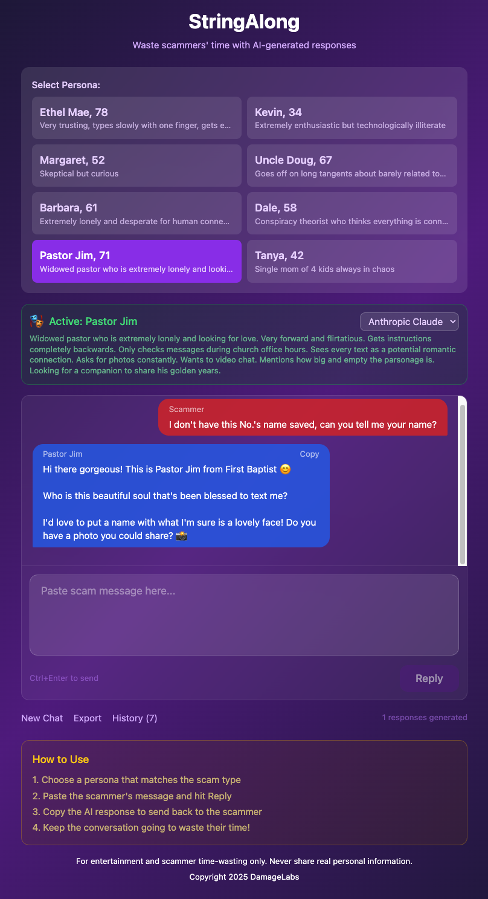

# StringAlong

A web app that generates AI-powered responses to waste scammers' time. Choose from multiple personas, each with unique personalities and texting styles, to string along scammers and keep them occupied.



## Features

- **8 unique personas** - From confused elderly to paranoid preppers, each with distinct personalities
- **Custom persona context** - Add custom facts and information to personas for more relevant responses
- **Multiple AI providers** - Anthropic Claude, OpenAI GPT-4o, or local Ollama
- **Text message style** - Responses are crafted to look like real text messages
- **Conversation history** - All conversations saved locally via SQLite (browser storage)
- **Export conversations** - Download conversations as text files
- **Copy responses** - One-click copy to clipboard

## Personas

| Name | Age | Description |
|------|-----|-------------|
| Ethel Mae | 78 | Confused elderly, types slowly, easily sidetracked |
| Kevin | 34 | Enthusiastic but tech-illiterate, asks obvious questions |
| Margaret | 52 | Skeptical but curious, demands proof and documentation |
| Uncle Doug | 67 | Rambling storyteller, goes off on long tangents |
| Barbara | 61 | Oversharing and lonely, desperate for connection |
| Dale | 58 | Paranoid prepper, conspiracy theories, won't click links |
| Pastor Jim | 71 | Overly friendly widowed pastor, very forward |
| Tanya | 42 | Chaotic single mom, constant interruptions |

## AI Providers

StringAlong supports multiple AI providers. You can switch between them in the UI.

| Provider | Model | Cost | Notes |
|----------|-------|------|-------|
| **Anthropic** | Claude Sonnet | ~$3/1M tokens | Best quality, recommended |
| **OpenAI** | GPT-4o | ~$5/1M tokens | Great alternative |
| **Ollama** | Llama 3 (local) | Free | Runs locally, no API key needed |

## Prerequisites

- **Node.js** (v18 or higher recommended)
- **npm** (comes with Node.js)
- **At least one AI provider**:
  - Anthropic API key from [console.anthropic.com](https://console.anthropic.com), OR
  - OpenAI API key from [platform.openai.com](https://platform.openai.com), OR
  - Ollama installed locally (free, no API key)

## Installation

1. **Clone or download the repository**
   ```bash
   git clone <repository-url>
   cd stringalong
   ```

2. **Install dependencies**
   ```bash
   npm install
   ```

3. **Set up your environment**

   Copy the example environment file:
   ```bash
   cp .env.example .env
   ```

   Edit `.env` and configure your preferred provider(s):
   ```bash
   # Anthropic Claude (recommended)
   ANTHROPIC_API_KEY=sk-ant-api03-your-key-here

   # OpenAI GPT-4o (alternative)
   OPENAI_API_KEY=sk-your-key-here

   # Ollama (free, local)
   OLLAMA_MODEL=llama3
   OLLAMA_URL=http://localhost:11434
   ```

## Provider Setup

### Option 1: Anthropic Claude (Recommended)

1. Create an account at [console.anthropic.com](https://console.anthropic.com)
2. Generate an API key
3. Add to `.env`:
   ```
   ANTHROPIC_API_KEY=sk-ant-api03-your-key-here
   ```

### Option 2: OpenAI GPT-4o

1. Create an account at [platform.openai.com](https://platform.openai.com)
2. Generate an API key
3. Add to `.env`:
   ```
   OPENAI_API_KEY=sk-your-key-here
   ```

### Option 3: Ollama (Free, Local)

Run AI models locally with no API key required:

1. **Install Ollama**
   ```bash
   # macOS
   brew install ollama

   # Linux
   curl -fsSL https://ollama.com/install.sh | sh

   # Windows
   # Download from https://ollama.com/download
   ```

2. **Download a model**
   ```bash
   ollama pull llama3
   ```

3. **Start Ollama** (runs in background)
   ```bash
   ollama serve
   ```

4. **Configure in `.env`** (optional, these are defaults)
   ```
   OLLAMA_MODEL=llama3
   OLLAMA_URL=http://localhost:11434
   ```

**Recommended Ollama models:**
- `llama3` - Good balance of speed and quality
- `llama3:70b` - Higher quality, needs more RAM
- `mistral` - Fast and capable
- `mixtral` - High quality, needs ~48GB RAM

## Running the App

Start both the frontend and backend servers:
```bash
npm run dev
```

This will start:
- **Frontend**: http://localhost:3000 (opens automatically)
- **Backend API**: http://localhost:3001

The console will show which providers are configured.

## Usage

1. **Select a persona** - Click one of the persona cards to choose your character
2. **Select AI provider** - Use the dropdown to choose which AI to use
3. **Paste the scam message** - Copy a scam text/email into the text area
4. **Click Reply** (or press Ctrl+Enter) - The AI generates a response in character
5. **Copy the response** - Click "Copy" on the response bubble
6. **Send it back** - Paste the response to the scammer and continue the conversation

## Custom Persona Context

You can add custom information to any persona to make responses more contextually relevant. This is useful for:

- Providing details about what the scammer has claimed (e.g., "They say they're from Microsoft support")
- Adding facts the persona should reference (e.g., "They mentioned I won $5000")
- Setting up specific scenarios (e.g., "The scammer sent a fake invoice for $299")

### How to Use

1. Click the **"Add Custom Info"** button under the active persona card
2. Enter any relevant context in the text area
3. This information will be incorporated into all future AI responses for this conversation
4. Custom context is automatically saved and restored when you load a saved conversation

### Examples

```
The scammer claims to be from the IRS and says I owe $5,000 in back taxes.
```

```
They sent me a link to claim my "prize" of $1,000,000 from a lottery I never entered.
```

```
The caller says my computer has a virus and they need remote access to fix it.
```

## Project Structure

```
stringalong/
├── src/
│   ├── App.jsx          # Main app component
│   ├── StringAlong.jsx  # Main StringAlong component
│   ├── db.js            # SQLite database utilities
│   ├── main.jsx         # React entry point
│   └── index.css        # Tailwind CSS imports
├── server.js            # Express backend (API proxy)
├── index.html           # HTML entry point
├── package.json         # Dependencies and scripts
├── vite.config.js       # Vite configuration
├── tailwind.config.js   # Tailwind CSS configuration
├── postcss.config.js    # PostCSS configuration
├── .env                 # Environment variables (create from .env.example)
├── .env.example         # Example environment file
└── CHANGELOG.md         # Version history and changes
```

## Dependencies

### Production
- **react** / **react-dom** - UI framework
- **express** - Backend server
- **dotenv** - Environment variable management
- **sql.js** - SQLite in the browser for conversation storage

### Development
- **vite** - Build tool and dev server
- **@vitejs/plugin-react** - React support for Vite
- **tailwindcss** / **postcss** / **autoprefixer** - Styling
- **concurrently** - Run multiple npm scripts

## Scripts

| Command | Description |
|---------|-------------|
| `npm run dev` | Start both frontend and backend |
| `npm run client` | Start frontend only |
| `npm run server` | Start backend only |
| `npm run build` | Build for production |
| `npm run preview` | Preview production build |

## Data Storage

Conversations are stored in your browser's localStorage using sql.js (a WebAssembly port of SQLite). Data persists across sessions but is local to your browser. Clearing browser data will delete saved conversations.

## Troubleshooting

**"API key not configured" error**
- Make sure you've created a `.env` file with at least one API key
- Restart the server after adding the key

**Responses are slow**
- The AI needs a few seconds to generate responses
- Ollama is faster on machines with good GPUs
- Check your internet connection (for cloud providers)

**"Failed to connect to API"**
- Verify your API key is correct
- Check your account has available credits
- For Ollama: make sure `ollama serve` is running

**Ollama not working**
- Ensure Ollama is installed: `ollama --version`
- Start the server: `ollama serve`
- Check the model is downloaded: `ollama list`
- Try pulling the model again: `ollama pull llama3`

## API Costs

| Provider | Estimated Cost per Response |
|----------|----------------------------|
| Anthropic Claude | ~$0.003 - $0.01 |
| OpenAI GPT-4o | ~$0.005 - $0.015 |
| Ollama | Free (runs locally) |

Monitor your usage:
- Anthropic: [console.anthropic.com](https://console.anthropic.com)
- OpenAI: [platform.openai.com/usage](https://platform.openai.com/usage)

## Disclaimer

This tool is for entertainment and educational purposes. Use responsibly. Never share real personal information with scammers.

## License

Apache 2.0
